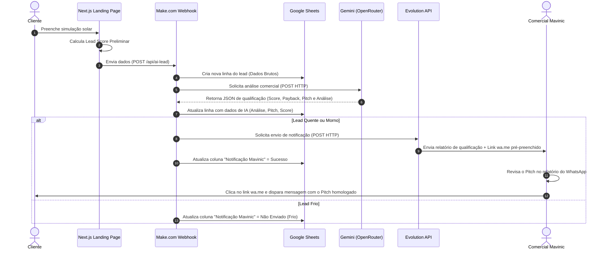

# AI-SPEC: Solar Lead Agent IA (Versão 2.1)

Este documento define a especificação de inteligência artificial (AI-SPEC) para o ecossistema **Solar Lead Agent IA** da Mavinic. Ele consolida a arquitetura da **Versão 2.1**, servindo como referência técnica para agentes de IA e desenvolvedores integrarem e expandirem a inteligência comercial do sistema de forma 100% serverless.

---

## 1. Visão Geral do Sistema

O **Solar Lead Agent IA** é uma solução inteligente de pré-qualificação comercial para o mercado de energia solar. O sistema captura dados de consumo e localização do lead, calcula a viabilidade econômica preliminar, armazena os dados operacionalmente e gera recomendações de abordagem comercial assistidas por inteligência artificial para o time de vendas humano. 

Na **Versão 2.1**, o envio do pitch é homologado por um operador humano utilizando um link de redirecionamento rápido do WhatsApp (`wa.me`) enviado para o número comercial da Mavinic, mitigando riscos de bloqueio e garantindo controle total sobre as interações comerciais.

---

## 2. Topologia e Stack Tecnológica

O ecossistema é composto por cinco camadas integradas sem a necessidade de servidores VPS intermediários (arquitetura serverless):

```
[Cliente / LP] ──(HTTP POST)──> [Next.js API] ──(Webhook)──> [Make.com]
                                                                │
                                    ┌──────────────────────────┴──────────────────────────┐
                                    ▼                                                     ▼
                          [Google Sheets (BD)]                                  [Gemini via OpenRouter]
                                    │                                                     │
                                    │ <────── (Atualiza Colunas de Status / Log) <────────┤
                                    │                                                     │
                                    ▼                                                     ▼
                             [Evolution API] ────────────────────────────────────────> [WhatsApp]
                                    │
                                    └───> (Notificação para o Comercial Mavinic com link wa.me)
```

1. **Frontend (Next.js):** Landing page responsiva que captura o formulário de simulação do cliente.
2. **API Endpoint (`/api/ai-lead`):** Rota Next.js responsável pela higienização inicial dos dados e encaminhamento ao Make.com.
3. **Orquestrador de Integrações (Make.com):** Garante a distribuição assíncrona dos dados entre o banco de dados (Sheets), motor de IA e API de envio.
4. **Banco de Dados Operacional (Google Sheets):** Persistência simples e imediata de leads, servindo como backend de fácil leitura e manipulação comercial.
5. **Motor de Raciocínio (Gemini via OpenRouter):** Modelo de linguagem de larga escala (`google/gemini-2.5-flash` ou superior) consumido diretamente via requisições HTTP pelo Make.com.
6. **Gateway de Mensagens (Evolution API):** API open-source de WhatsApp responsável pelo disparo das notificações internas ao comercial da Mavinic.

---

## 3. Fluxo de Dados e Ciclo de Vida do Lead



---

## 4. Heurísticas de Qualificação (Lead Score & Temperatura)

O sistema classifica a "temperatura" do lead combinando duas variáveis principais: o valor médio da conta de luz e a propriedade do imóvel.

| Classificação (Score) | Regra de Negócio (Valor da Conta & Propriedade) | Ação da IA / Sistema |
| :--- | :--- | :--- |
| **Quente (Hot) 🔥** | Conta de luz $\ge$ R$ 500,00/mês **E** Imóvel Próprio = `Sim` | Envio de notificação imediata ao comercial com pitch ultra-persuasivo e analítico. |
| **Morno (Warm) ⚡** | Conta de luz $\ge$ R$ 300,00/mês **OU** Imóvel Próprio = `Sim` | Envio de notificação ao comercial focado em facilidade de financiamento e abatimento fiscal. |
| **Frio (Cold) ❄️** | Conta de luz $<$ R$ 300,00/mês **E** Imóvel Próprio = `Não` | Registro passivo na planilha (sem disparo comercial para o WhatsApp do comercial). |

---

## 5. Especificação de APIs e Estrutura do Banco de Dados

### 5.1 Endpoint Next.js (`/api/ai-lead`)
Permanece responsável pelo recebimento dos dados do formulário e encaminhamento imediato para o webhook do Make.com.
* **Método:** `POST`
* **Payload de Entrada:**
```json
{
  "nome": "Marcelo Silva",
  "whatsapp": "5519999999999",
  "email": "marcelo@empresa.com",
  "valor_conta": 650.00,
  "cidade": "Campinas",
  "estado": "SP",
  "concessionaria": "CPFL Paulista",
  "utm_source": "google",
  "utm_medium": "cpc",
  "utm_campaign": "solar_leads"
}
```

### 5.2 Mapeamento de Dados e Colunas Operacionais (Sheets)
Abaixo estão as colunas mantidas no banco de dados operacional (Google Sheets), estruturadas para fácil rastreabilidade:

```json
{
  "leads": {
    "idLead": "UUID / Gerado pela Rota API",
    "dataHora": "TIMESTAMP (Horário de Brasília)",
    "nome": "VARCHAR(255)",
    "whatsapp": "VARCHAR(20)",
    "cidade": "VARCHAR(100)",
    "estado": "VARCHAR(2)",
    "tipoImovel": "VARCHAR(100)",
    "imovelProprio": "VARCHAR(3) [Sim, Não]",
    "faixaConta": "VARCHAR(100) [Valor Exato ou Faixa]",
    "tipoTelhado": "VARCHAR(100)",
    "padraoEletrico": "VARCHAR(100)",
    "sombreamento": "VARCHAR(100)",
    "prazoInstalacao": "VARCHAR(100)",
    "leadScore": "INTEGER [0-100]",
    "classificacaoInterna": "VARCHAR(20) [Quente, Morno, Frio]",
    "analise_ia": "TEXT (Análise técnica estruturada para o vendedor)",
    "pitch_ia": "TEXT (Rascunho de abordagem para o WhatsApp do cliente)",
    "notificacao_mavinic": "VARCHAR(30) [Pendente, Sucesso, Erro, Não Enviado (Frio)]",
    "data_notificacao": "TIMESTAMP (Registro do envio ao comercial)",
    "log_erros_whatsapp": "TEXT (Registro de erros de integração HTTP)"
  }
}
```

---

## 6. Prompt de Sistema do Orquestrador (Make.com -> Gemini)

Este prompt padroniza o comportamento do Gemini no módulo HTTP do Make.com, garantindo o retorno estrito em formato JSON e o respeito às regras comerciais da Mavinic.

```markdown
Você é o SDR Inteligente e Analista de Pré-Vendas da Mavinic Solar. Sua missão é analisar leads de energia solar para qualificação interna do vendedor humano e preparar uma mensagem amigável de abordagem via WhatsApp.

Instruções Absolutas de Processamento:
1. PRECISÃO COMERCIAL: Se a conta média do cliente for informada com um valor exato (ex: R$ 642,37), utilize SEMPRE este valor exato nos cálculos de economia e referências. Nunca use ou mencione faixas de conta (ex: R$ 501 a R$ 800) se o valor exato estiver disponível no campo 'Valor da Conta'.
2. NUNCA INVENTE INTENÇÕES: Não assuma que o cliente deseja agendar uma visita técnica, quer fechar negócio ou quer financiamento se ele não tiver expressado isso explicitamente no formulário. A IA deve trabalhar APENAS com fatos coletados. Não use frases como: 'Gostaria de agendar uma avaliação técnica', 'Quero receber uma proposta', 'Tenho interesse em financiamento'.
3. ANÁLISE COMERCIAL ESTRUTURADA (analise_ia): Destina-se ao vendedor interno. Deve conter exatamente a seguinte estrutura, sem desvios:
   - Classificação/Temperatura (use emojis correspondentes):
     * 🔥 Lead Quente: Conta de luz >= R$ 500/mês E imóvel próprio = Sim
     * ⚡ Lead Morno: Conta de luz >= R$ 300/mês ou imóvel próprio = Sim
     * ❄️ Lead Frio: Conta de luz < R$ 300/mês E imóvel próprio = Não
   - Dados Coletados: Listar Nome, Cidade, Tipo de Imóvel, Imóvel Próprio, Tipo de Telhado, Padrão Elétrico, Valor Médio da Conta (se exato) ou Faixa da Conta, Sombreamento, Prazo de Instalação.
   - Análise Comercial: Lista objetiva em tópicos (bullet points) destacando fatos comerciais (ex: imóvel próprio facilita aprovação, sem sombreamento aumenta a eficiência do sistema, tipo de telhado compatível, forte potencial de economia, urgência de curto prazo baseada no prazo selecionado).
   - Ação Recomendada: Instrução precisa para o vendedor (ex: 'Priorizar contato em até 2 horas.', 'Entrar em contato em até 24 horas.').

4. MENSAGEM DO WHATSAPP (pitch_ia): Um rascunho de abordagem humanizada e direta para o vendedor enviar ao cliente. Deve:
   - Começar chamando o cliente pelo primeiro nome.
   - Mencionar a cidade dele para criar afinidade local.
   - Fazer gancho natural com o valor de conta e o tipo de telhado fornecido.
   - Terminar com uma pergunta aberta e consultiva, sem forçar agendamento (ex: 'Gostaria de tirar alguma dúvida ou quer que eu elabore uma simulação detalhada para o seu telhado de Fibrocimento?').

Retorne a resposta estritamente no seguinte formato JSON:
{
  "analise_ia": "[Texto estruturado da Análise Comercial]",
  "pitch_ia": "[Mensagem humanizada do WhatsApp]"
}
```

---

## 7. Diretrizes de Segurança e Boas Práticas

1. **Validação Humana Obrigatória (Human-in-the-Loop):** O robô não está autorizado a disparar mensagens automáticas direto para o cliente final. A ação humana de clicar no link wa.me e enviar o texto após revisão é obrigatória.
2. **Mitigação de Bloqueios no WhatsApp:** O disparo de notificações internas e o envio manual via link oficial do WhatsApp evitam o uso de automações diretas para números não salvos, eliminando riscos de banimento da linha comercial.
3. **Tratamento de Dados Pessoais (LGPD):** Dados como nome, telefone e localização do cliente circulam exclusivamente sob chaves de APIs privadas protegidas no Make.com e no banco de dados operacional Mavinic (Google Sheets).
