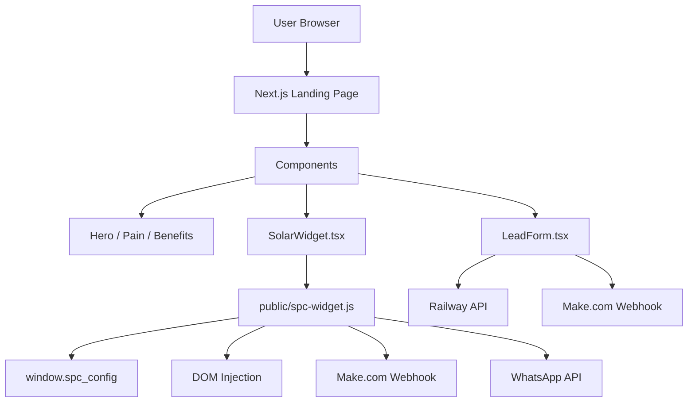

# Project Architecture: Solar Energy Ecosystem

This document describes the structural relationship between the Landing Page and the Solar Calculator Widget.

## Component Overview

## System Layers

### 1. Presentation Layer (Next.js)
- **Static Content**: High-fidelity UI built with Tailwind CSS.
- **Interactivity**: Framer Motion for smooth transitions and hover effects.
- **Lead Capture**: Custom form in `LeadForm.tsx` for direct simulation requests.

### 2. Logic Layer (Solar Pro Widget)
- **Portable Script**: `spc-widget.js` is self-contained. It handles its own styles, HTML injection, and calculation logic.
- **Dynamic Configuration**: The Next.js wrapper passes business constants (rates, costs) via the `window.spc_config` object.
- **Visuals**: Uses Glassmorphism and CSS animations to match the premium feel of the LP.

### 3. Data & Automation Layer
- **Lead Processing**: Leads are sent to Make.com for CRM integration and Railway for database/notifications.
- **Analytics**: Pushes events to GTM (DataLayer) for conversion tracking.

## Key Files
- `app/page.tsx`: Main entry point.
- `app/components/SolarWidget.tsx`: Integration bridge for the calculator.
- `public/spc-widget.js`: The "brain" of the solar calculator.
- `app/components/LeadForm.tsx`: Final CTA capture form.
